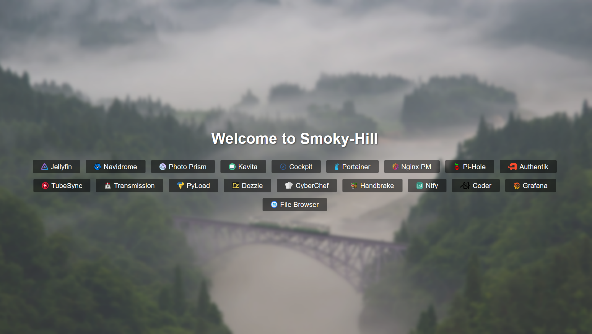

# Smoky Hill Dashboard
A single html file that you can use as a link dashboard for anything

## Features

- Easy customization: You can replace text, background images, and button links to tailor the website to your needs.
- Responsive design: The template includes responsive styles for smaller screens, making it suitable for mobile devices.

## Preview

##### *The default config*
##### *[Wallpaper by Mark Harpur](https://unsplash.com/photos/K2s_YE031CA)*
---

##### *My current config*
##### *[Wallpaper by Unknown](https://free4kwallpapers.com/nature/foggy-hills-16472-wallpaper--RLDK)*
---

## Getting Started

To use this template, follow these steps:

1. Clone this repository to your local machine or download the ZIP file.
2. Open the `index.html` file in your favorite text editor or code editor.
3. Customize the following elements to make the website your own:
   - Favicon: Replace the `FAVICON URL` in the `<link>` tag.
   - Background Image: Replace `YOUR_BACKGROUND_IMAGE_URL` in the CSS styles.
   - Main Heading: Change the text inside the `<h1>` tag.
   - Button Links: Update the `href` attributes in the button links.
   - Optional Logo: Uncomment and replace the `` tag for a custom logo.
   - Optional Text Card: Uncomment and customize the text and heading inside the `.text-card` div.
4. Save your changes.

## License

This project is licensed under the MIT License - see the [LICENSE]([LICENSE.md](https://github.com/SteamWo1f/Smoky-Hill-Dash/blob/main/LICENSE)) file for details.

## Other

Feel free to fork and modify this template to suit your needs.

## Star History

<a href="https://star-history.com/#SteamWo1f/Smoky-Hill-Dash&Date">
  <picture>
    <source media="(prefers-color-scheme: dark)" srcset="https://api.star-history.com/svg?repos=SteamWo1f/Smoky-Hill-Dash&type=Date&theme=dark" />
    <source media="(prefers-color-scheme: light)" srcset="https://api.star-history.com/svg?repos=SteamWo1f/Smoky-Hill-Dash&type=Date" />
    
  </picture>
</a>

